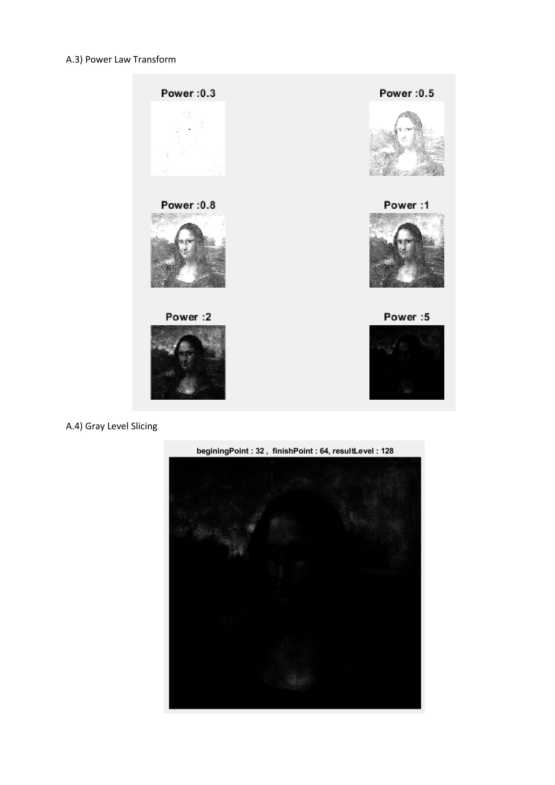

# Fundamental Image Processing Functions with Matlab

Functions are for 8 bit monochrome images (single channel images having values [0-255]). 
You may first convert to uint8 type if you use rgb images. The function outputs are shown below.

